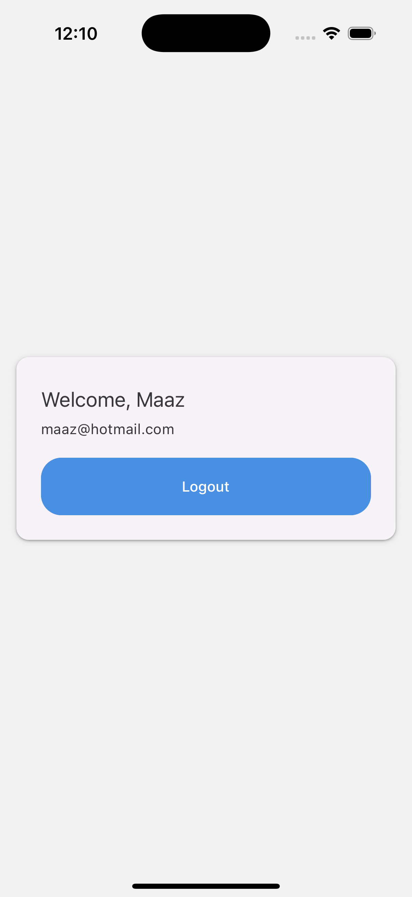
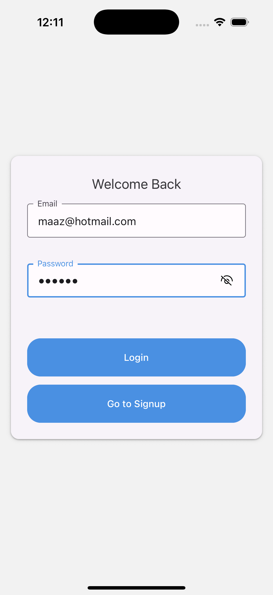
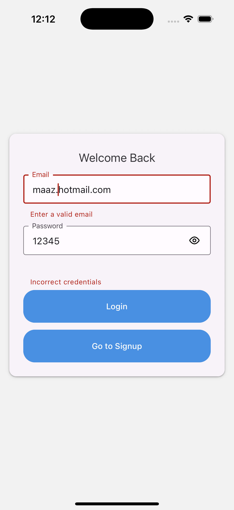
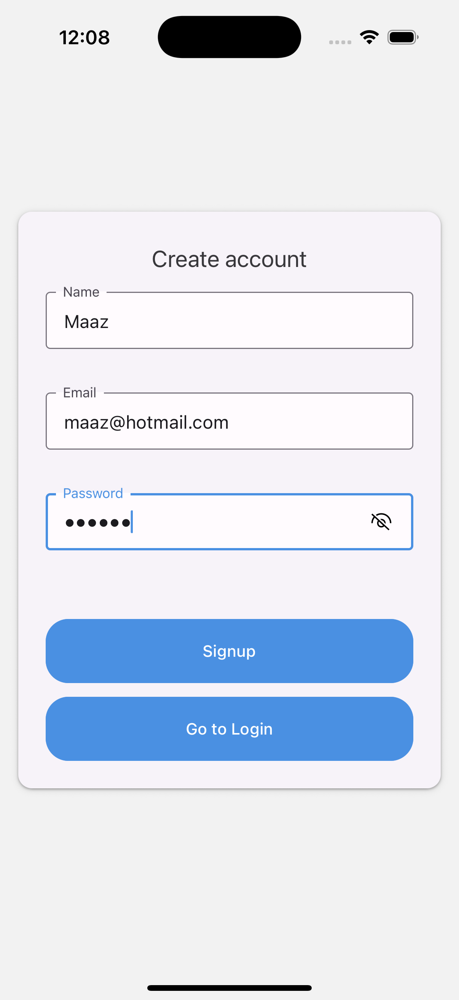
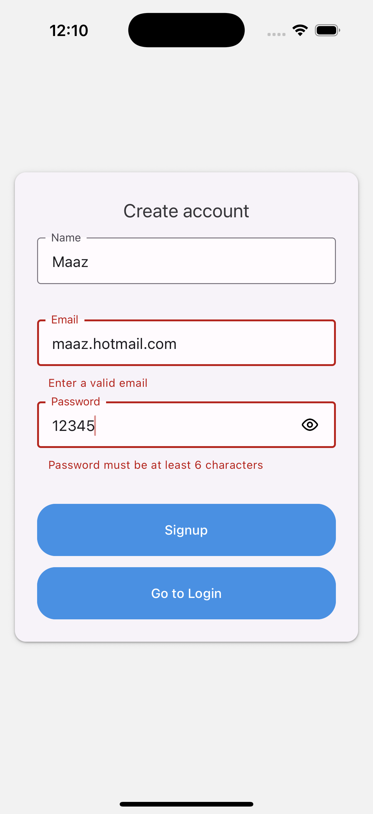

# 📱 React Native User Authentication App (TypeScript)

A modern **User Authentication App** built with **React Native (TypeScript, bare workflow)** featuring **Login, Signup, and Home screens**.  
This project demonstrates **authentication state management, reusable components, persistence, and modern UI practices**.

---

## 🚀 Tech Stack
- ⚛️ **React Native** (TypeScript, bare workflow — non-Expo)  
- 🔑 **React Context API** for authentication  
- 🧭 **React Navigation v6**  
- 💾 **AsyncStorage** for persistence  
- 🎨 **Reusable UI components** (`InputField`, `PrimaryButton`)  
- 👁 **Password visibility toggle**  

---

## ✨ Features
1. **AuthContext**
   - `login(email, password)`
   - `signup(name, email, password)`
   - `logout()`
   - Persistent `user` state with AsyncStorage

2. **Screens**
   - 🔐 **Login** – validation + error messages  
   - 📝 **Signup** – validation (required fields, email format, password length)  
   - 🏠 **Home** – displays user info + logout  

3. **UI/UX**
   - Reusable **InputField** with error handling + password toggle  
   - **PrimaryButton** for consistent actions  
   - Keyboard aware, safe area friendly  

4. **Persistence**
   - Keeps the user logged in even after app restart  

---

## 🖼️ App Screenshots  

| **Home** | **Login** | **Login Error** |
|----------|-----------|-----------------|
|  |  |  |

| **Signup with Eye Closed** | **Signup Error** |
|-----------------------------|------------------|
|  |  |

---

## ⚡ Installation & Setup

```bash
# Create project (bare RN with TypeScript)
npx react-native init UserAuthApp --template react-native-template-typescript

# Navigate
cd UserAuthApp

# Install dependencies
npm install @react-navigation/native @react-navigation/native-stack
npm install @react-native-async-storage/async-storage
npm install react-native-vector-icons

# iOS specific
cd ios && pod install && cd ..
````

---

## 🏃 Running the App

```bash
# Start Metro
npx react-native start

# Run on Android
npx react-native run-android

# Run on iOS
npx react-native run-ios
```

---

## 📌 Future Improvements
* 🔐 Add real backend API integration

---

💡 *This project is designed as a clean starter for authentication flows in React Native apps.* 🚀

```

---